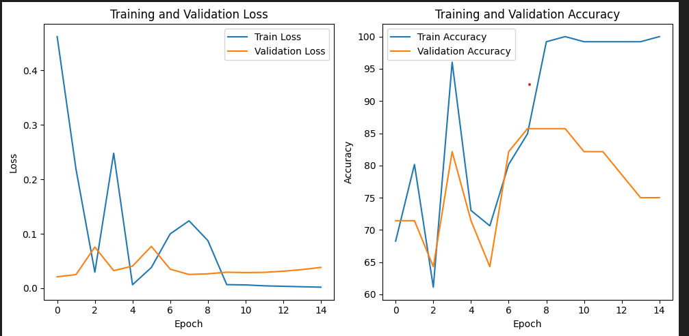
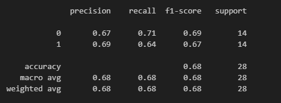
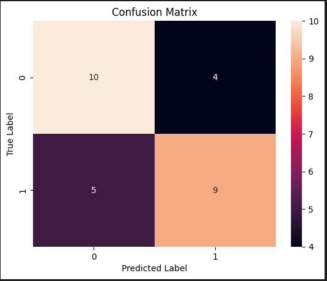

# Brain Tumor Detection using MRI Images - Practice

<b>This is a practice project for me to implement want I learn from MLDawn Brain Tumor Detection series. This project is not his copy rather done on my own at some sections.</b>
This project implements a brain tumor detection model using MRI images.  It leverages a Convolutional Neural Network (CNN) based on a pre-trained ResNet18 architecture for image classification.  The model is trained to distinguish between MRI images containing brain tumors and those that do not.

## Table of Contents

- [Project Overview](#project-overview)
- [Dataset](#dataset)
- [Model Architecture](#model-architecture)
- [Requirements](#requirements)
- [Installation](#installation)
- [Usage](#usage)
- [File Structure](#file-structure)
- [Training](#training)
- [Evaluation](#evaluation)
- [Streamlit App](#streamlit-app)

## Project Overview

Brain tumors are a serious health concern, and early detection is crucial for effective treatment.  This project aims to develop an automated system for detecting brain tumors in MRI images using deep learning techniques.  The model is trained on a dataset of labeled MRI images and can be used to classify new images as either containing a tumor or not.

## Dataset

The dataset used for training and evaluation consists of MRI images of the brain, from patients with either "tumor" or "no tumor."  The dataset was undersampled to balance the classes. Dataset is not included in this repository as it is a large files. 

> Dataset Link: https://www.kaggle.com/datasets/navoneel/brain-mri-images-for-brain-tumor-detection </br>

Few images of dataset is seen below:


## Model Architecture

The model is based on the ResNet18 architecture, pre-trained on ImageNet. The pre-trained model's fully connected layer (`fc`) is replaced with a custom classifier head suitable for binary classification.  The classifier head consists of several fully connected layers, ReLU and Tanh activation functions, and dropout for regularization. Architure of classifier is given below.


## Requirements

The project uses Python and several libraries. Especially,

```
PyTorch with Cuda & DNN.
```

## Installation

1.  Clone the repository:

    ```bash
    git clone https://github.com/UmerSalimKhan/Brain-Tumor-Detection.git
    cd Brain-Tumor-Detection
    ```

2.  Create a virtual environment (recommended):

    ```bash
    python3 -m venv brain_tumor_env  # Or virtualenv brain_tumor_env
    source brain_tumor_env/bin/activate  # On Linux/macOS
    brain_tumor_env\Scripts\activate  # On Windows
    ```

3.  Install the requirements:

    ```bash
    pip install -r requirements.txt
    ```

## Usage

### Training Evaluation

Training & Evaluation is done in the same notebook (Barin_Tumor_Detection.ipynb) using Jupyter Notebook.

### Streamlit App

1.  Run the Streamlit app:

    ```bash
    streamlit run app.py
    ```

2.  Open your web browser and go to the URL provided by Streamlit (usually `http://localhost:8501`).

## File Structure

This is how the file structure should looks like. As told earlier dataset is not pushed. Also note, trained model weights is not pushed. 

```
brain-tumor-detection/
├── app.py              # Streamlit app
├── brain_tumor_model.pth # Trained model weights
├── data/               # (If applicable) Data directory
├── requirements.txt    # Project dependencies
├── Brain_Tumor_Detection.ipynb # Main Jupyter Notebook file of Code
├── .gitignore          # Files to ignore by Git
└── README.md           # This file
```

## Training Evaluation

1. Training & Evaluation
</br>

</br>

3. Classification Report
</br>

</br>

5. Confusion Matrix
</br>

</br>

## Streamlit App

The Streamlit app allows users to upload an MRI image and get a prediction from the trained model.  It displays the uploaded image and outputs "Detected" or "Not Detected" depending on the model's prediction. It needs some improvement. As the app is not running as expected. The PyTorch with CUDA is using Numpy of older version. However, the Numpy needed is around version 2x for several tasks.
